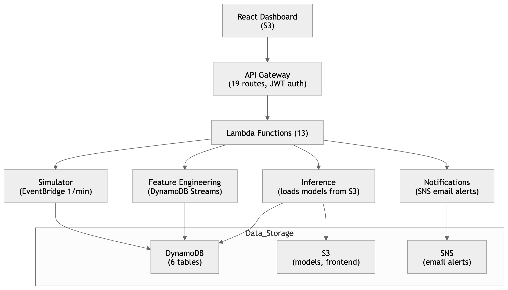

# CloudWatch AI

Real-time AIOps platform for predictive incident detection in cloud services. Uses Gradient Boosting models to predict service degradation up to 15 minutes in advance, achieving 0.91 precision with ~36-minute lead time and fewer than 1 false alarm per service per day.

**Course:** CS6905 -- Cloud Information Management Systems, University of New Brunswick

## Architecture



**Services monitored:** Web API, DB Pool, Message Queue, Auth Service, ML Pipeline

**Scenarios:** Web API Degradation, DB Cascade Failure, Message Queue Backlog, Auth Service Failure, ML Pipeline Drift, Normal Operations

## Tech Stack

| Layer | Technology |
|-------|-----------|
| Frontend | React 19, TypeScript, Vite, Tailwind CSS 4, Recharts |
| API | AWS API Gateway (HTTP API), JWT Authorizer |
| Compute | AWS Lambda (Python 3.11/3.12, Docker) |
| Database | DynamoDB (6 tables with Streams, per-user isolation) |
| Storage | S3 (models, frontend) |
| Notifications | Amazon SNS (per-user email alerts) |
| Auth | AWS Cognito (SRP protocol) |
| Scheduler | EventBridge (1-min interval) |
| ML | scikit-learn Gradient Boosting Classifier |

## Project Structure

```
.
├── dashboard/                  # React 19 frontend application
│   ├── src/
│   │   ├── components/         # Layout, Sidebar, ServiceHealthCard
│   │   ├── pages/              # LiveControls, KPITimeline, Alerts, Analytics
│   │   ├── hooks/              # useApi (with auto-polling), useAuth, useTheme
│   │   ├── lib/                # API client, auth helpers, chart colors
│   │   └── data/               # TypeScript type definitions
│   └── vite.config.ts
├── lambdas/                    # All 13 AWS Lambda functions
│   ├── simulator_lambda/       # Generates KPI metrics for 5 services
│   ├── feature_engineering_lambda/  # Computes 8 rolling features
│   ├── inference_lambda/       # ML prediction + SNS alerts (Docker)
│   ├── control_simulation_lambda/   # Start/stop/state endpoints
│   ├── services_lambda/        # GET /services
│   ├── kpi_lambda/             # GET /kpi/{serviceId}
│   ├── alerts_lambda/          # GET /alerts/active, /alerts/history
│   ├── incidents_lambda/       # GET /incidents
│   ├── analytics_lambda/       # GET /analytics/*
│   ├── threshold_lambda/       # GET /thresholds
│   ├── get_metrics_lambda/     # GET /metrics
│   ├── get_logs_lambda/        # GET /logs
│   ├── notifications_lambda/   # Email subscribe/unsubscribe via SNS
│   └── infrastructure/         # DynamoDB schemas, API Gateway routes,
│                               # EventBridge rules, SNS topic, stream triggers
├── ml/                         # Machine learning pipeline
│   ├── lambda_function.py      # Inference handler (also in lambdas/)
│   ├── Dockerfile              # Lambda container image
│   ├── work.ipynb              # Analysis notebook
│   ├── data/
│   │   └── retrain_and_export.py  # Model training script
│   └── output/                 # Trained models + thresholds
│       ├── model_h5.pkl
│       ├── model_h10.pkl
│       ├── model_h15.pkl
│       ├── thresholds.json
│       └── feature_importances.json
├── docs/                       # Documentation and reports
│   ├── implementation-report.tex   # LaTeX implementation report
│   ├── slides.tex                  # Presentation slides
│   ├── images/                     # Screenshots for the report
│   ├── figures/                    # ML performance charts
│   ├── testing-documentation.md
│   ├── manual-testing-documentation.md
│   ├── security-audit.md
│   ├── project_spec.md
│   ├── video-script.md
│   └── *.pdf                       # Proposal, design doc, API contract
└── README.md
```

## ML Pipeline

**Models:** 3 Gradient Boosting Classifiers (one per prediction horizon: 5, 10, 15 minutes)

**Training:** 100 trees, max depth 3, learning rate 0.1, trained on the AIOps KPI dataset (2.4M timesteps across 26 cloud services).

**Features (8):**

| Feature | Type | Importance |
|---------|------|-----------|
| roll_mean | KPI | 31.1% |
| error_rate | Log | 26.6% |
| roll_max | KPI | 19.8% |
| roll_std | KPI | 12.9% |
| severity_change_flag | Log | 4.6% |
| first_diff | KPI | 3.5% |
| roll_slope | KPI | 1.0% |
| warn_rate | Log | 0.4% |

**Performance:**

| Metric | Value |
|--------|-------|
| Precision | 0.91 |
| Mean Lead Time | ~36 min |
| False Alarm Rate | <=1/day per service |
| Detection Rate | 8.7% |

## API Endpoints

Base URL: `https://p9fpx4nhh6.execute-api.ca-central-1.amazonaws.com`

All routes are JWT-protected via AWS Cognito.

| Method | Endpoint | Description |
|--------|----------|-------------|
| GET | `/services` | List monitored services |
| GET | `/kpi/{service_id}` | KPI time series for a service |
| GET | `/thresholds` | Alert thresholds per horizon |
| GET | `/alerts/active` | Active alerts |
| GET | `/alerts/history` | Historical alerts |
| POST | `/alerts/{id}/acknowledge` | Acknowledge an alert |
| GET | `/incidents` | Grouped incidents |
| GET | `/simulation/state` | Simulation status |
| POST | `/simulation/start` | Start simulation (body: `{ scenario }`) |
| POST | `/simulation/stop` | Stop simulation |
| GET | `/analytics/summary` | Summary statistics |
| GET | `/analytics/methods` | Model comparison |
| GET | `/analytics/features` | Feature importance |
| GET | `/analytics/lead-times` | Lead time distribution |
| GET | `/metrics` | Raw metric records |
| GET | `/logs` | Service log records |
| GET | `/notifications/status` | Email subscription status |
| POST | `/notifications/subscribe` | Subscribe to email alerts |
| POST | `/notifications/unsubscribe` | Unsubscribe from email alerts |

## DynamoDB Tables

All tables use per-user data isolation via `owner_id` partitioning.

| Table | Partition Key | Sort Key | Purpose |
|-------|--------------|----------|---------|
| KPIMetrics | owner_service | timestamp | Raw service metrics |
| ServiceLogs | owner_service | timestamp | Event logs |
| FeatureStore | owner_service | timestamp | Computed features |
| Alerts | owner_id | created_at | Prediction alerts |
| Incidents | owner_id | created_at | Grouped alerts |
| SimConfig | owner_id | config_key | Simulation state |

## Getting Started

### Frontend

```bash
cd dashboard
npm install
npm run dev
```

The dev server proxies `/api` requests to the API Gateway. Open `http://localhost:5173`.

### Deploy Frontend

```bash
cd dashboard
npm run build
aws s3 sync dist/ s3://cloud-project-dashboard1/ --delete --exclude "models/*"
```

### Retrain Models

```bash
cd ml/data
python retrain_and_export.py
aws s3 cp ../output/ s3://cloud-project-dashboard1/models/ --recursive
```

### Deploy Inference Lambda

```bash
cd ml
docker build --platform linux/amd64 -t inference-lambda .
# Tag and push to ECR, then update Lambda function code
```

## Dashboard Pages

- **Live Controls** -- Start/stop 6 simulation scenarios, monitor service health in real time
- **KPI Timeline** -- Time-series charts with prediction score overlays and threshold lines
- **Alerts** -- Active and historical alerts with severity badges, incident timelines, email notification toggle
- **Analytics** -- Model precision vs detection rate, lead time distributions, feature importance

Auto-polling (5s) with visibility-based pausing. Supports dark and light themes with persistent preference.

## Team

- Alfarizy Alfarizy (3810253)
- Akinbobola Akin (3784664)
- Ishimwe Pacis Hanyurwimfura (3787234)
